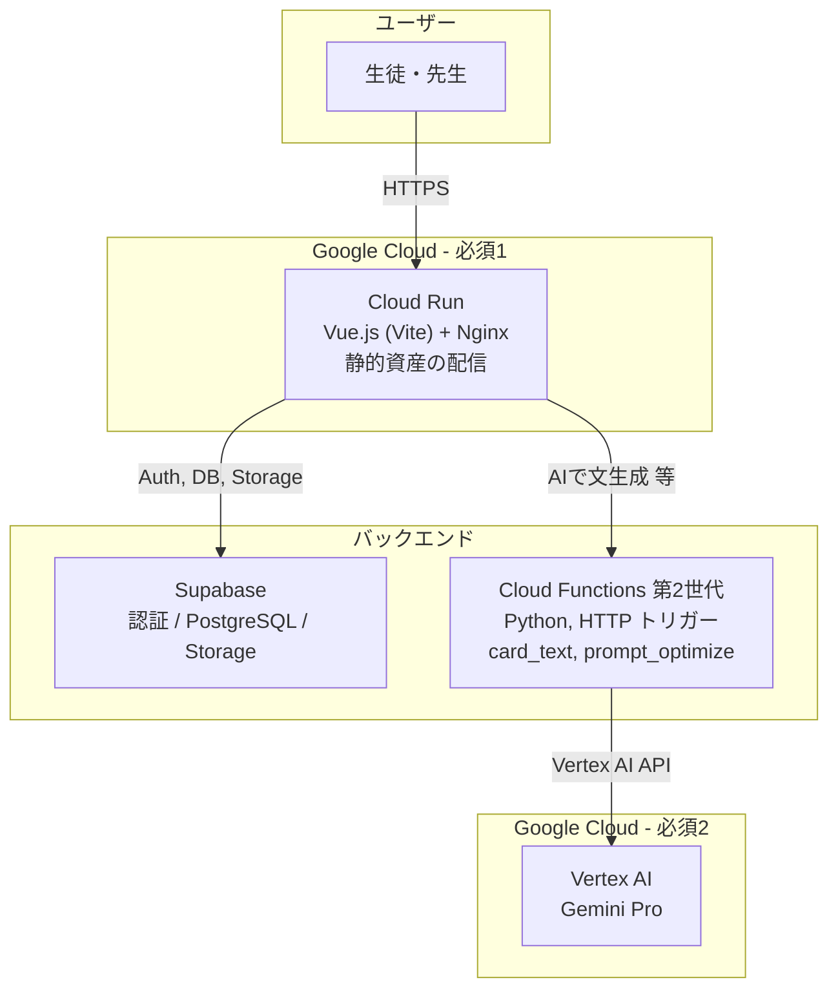

# ハッカソン応募用 実施計画書

本ドキュメントは、Nano Banaan Dashboard（放課後キャンパスクラブ）をハッカソンに応募するための実施計画です。  
既存のプロジェクト計画はルートの `plans.md` を参照してください。

---

## 1. 応募方針

| 項目 | 方針 |
|------|------|
| **データベース** | Supabase を維持（期間制約のため Firebase 移行は行わない） |
| **必須要件** | Google Cloud アプリ実行プロダクト 1 以上 + Google Cloud AI 技術 1 以上を確実に満たす |
| **AI 利用** | 運営推奨に従い **Vertex AI 経由** で Gemini API を利用する |

---

## 2. 採用ツール一覧（ハッカソン要件との対応）

`docs/HACKATHOON_GUIDE.md` に基づく選定です。

### 2.1 (必須) Google Cloud アプリケーション実行プロダクト

| 採用ツール | 役割 | 対応状況 |
|------------|------|----------|
| **Cloud Run** | Vue.js フロントエンドのホスティング。Docker コンテナ化してデプロイ。 | **完了**（Dockerfile / cloudbuild.yaml でデプロイ済み。本番 URL で公開可能） |

### 2.2 (必須) Google Cloud AI 技術

| 採用ツール | 役割 | 対応状況 |
|------------|------|----------|
| **Vertex AI (Gemini)** | カードのテキスト生成（タイトル・フレーバーテキスト・褒め言葉）。プロンプト最適化。Minecraft スクショ解析（Vision）は H2-4 で未実装。 | **デモ可能**（Cloud Functions 経由で「AIで文生成」から利用可能） |

※ **Vertex AI 経由** で利用し、API キーはフロントに露出させない（Cloud Functions 等のバックエンド経由で呼び出す）。

### 2.3 その他（任意・既存スタック）

| 技術 | 役割 |
|------|------|
| **Supabase** | 認証 (Auth)、PostgreSQL（profiles / cards / minecraft_works）、Storage（画像・.glb） |
| **@google/model-viewer** | Minecraft 3D モデル表示（Google 技術としてアピール可能） |

---

## 3. アーキテクチャ概要

### システムアーキテクチャ図



- **フロント:** Cloud Run で配信（Dockerfile + ビルド成果物のサーブ）。ブラウザでは `@google/model-viewer` で 3D 表示。
- **AI:** Vertex AI は Cloud Functions（第2世代）から呼び出し、API キーをクライアントに露出させない。
- **データ:** 既存の Supabase をそのまま利用。

### 従来のテキスト図（参照用）

```
┌─────────────────────────────────────────────────────────────────┐
│  ユーザー (生徒・先生)                                            │
└─────────────────────────────┬───────────────────────────────────┘
                              │
                              ▼
┌─────────────────────────────────────────────────────────────────┐
│  Cloud Run (必須1)                                               │
│  Vue.js (Vite) アプリケーション ※静的資産を Nginx 等で配信         │
└─────────────────────────────┬───────────────────────────────────┘
                              │
         ┌────────────────────┼────────────────────┐
         │                    │                    │
         ▼                    ▼                    ▼
┌─────────────────┐  ┌─────────────────┐  ┌─────────────────┐
│ Supabase        │  │ Cloud Functions │  │ Vertex AI 呼出   │
│ Auth / DB       │  │ (Python)        │  │ (必須2)          │
│ Storage         │  │ ※Vertex AI 呼出 │  │                  │
└─────────────────┘  └────────┬────────┘  └────────┬────────┘
                               │                     │
                               └──────────┬──────────┘
                                          ▼
                               ┌─────────────────────┐
                               │ Vertex AI (必須2)    │
                               │ Gemini Pro / Vision │
                               └─────────────────────┘
```

---

## 4. 実装ロードマップ（ハッカソン向け）

### Phase H1: Cloud Run 化（必須1 の充足）

- [x] **H1-1** 本番用 `Dockerfile` の作成（マルチステージ: Node でビルド → Nginx で配信）。`nginx.conf`（SPA 用）・`.dockerignore` を追加済み。
- [x] **H1-2** `cloudbuild.yaml` で Cloud Build → Cloud Run デプロイを再現可能にした。手順は `docs/DEPLOY_CLOUD_RUN.md` を参照。
- [x] **H1-3** 環境変数（Supabase URL/Anon Key）をビルド時に `--substitutions` で注入する手順を `docs/DEPLOY_CLOUD_RUN.md` に記載。

**補足:** ローカルに Docker Desktop は不要。`gcloud builds submit` で Cloud Build がクラウド上でビルドし、Cloud Run にデプロイする。

**成果物:** 審査員が「Cloud Run で動いている」ことを確認できる状態。

**注意事項（Phase H1）:**

- **403 Forbidden が表示される場合:** デプロイ直後に URL を開くと「Your client does not have permission to get URL /」と出ることがある。Cloud Run の IAM で未認証呼び出しが許可されていないため。**対処:** プロジェクトオーナー等で `gcloud run services add-iam-policy-binding campusclub-dashboard --region=asia-northeast1 --member=allUsers --role=roles/run.invoker` を 1 回実行する。詳細は `docs/DEPLOY_CLOUD_RUN.md` の「403 Forbidden が表示される場合」を参照。
- **Cloud Run のポート:** 本番は `PORT=8080` を想定。`nginx.conf` は 8080 でリッスンするよう設定済み。
- **Cloud Build の IAM:** `cloudbuild.yaml` にデプロイ後の IAM 付与ステップを含めているが、Cloud Build のサービスアカウントに Cloud Run の IAM 変更権限がないとそのステップは失敗する。その場合は上記の手動コマンドで 1 回付与する。

---

### Phase H2: Vertex AI 連携（必須2 の充足）

- [x] **H2-1** Google Cloud プロジェクトで Vertex AI API を有効化。サービスアカウントに Vertex AI User を付与。（手順: `docs/VERTEX_AI_SETUP.md`）
- [x] **H2-2** Cloud Functions (第2世代) を 1 本作成。Python、HTTP トリガー。リクエストボディで「カード用テキスト生成の入力」を受け取る。（`functions/main.py`）
- [x] **H2-3** 関数内で `google-genai`（Vertex AI 利用）を用い、Gemini モデルを呼び出す（テキスト生成）。`card_text` / `prompt_optimize` の 2 アクション対応。
- [ ] **H2-4** （時間があれば）Gemini Vision で Minecraft スクショの解析・褒め言葉生成を追加。
- [x] **H2-5** Vue アプリから Cloud Functions の URL を呼び出す処理を追加。`vertexAiService.ts` と CardGenerationForm の「AIで文生成」ボタン（`VITE_VERTEX_AI_FUNCTION_URL` 設定時のみ表示）。

**成果物:** 「Vertex AI（Gemini）経由で AI が動いている」ことをデモ可能な状態。

---

### Phase H3: 提出・ドキュメント整備

- [x] **H3-1** README または提出用ドキュメントに「採用ツール」を明記する。
  - 必須1: Cloud Run（＋必要に応じて Cloud Functions）
  - 必須2: Vertex AI (Gemini)
- [x] **H3-2** デプロイ手順・デモ手順を簡潔に記載し、審査員が再現できるようにする。
- [x] **H3-3** 既存の `plans.md` や `AGENTS.md` はそのまま参照用として利用。

---

## 5. 審査用アピールポイント

- **必須要件の明確な充足:** Cloud Run（アプリ実行）＋ Vertex AI（Gemini）で、指定カテゴリを確実にカバー。
- **Vertex AI 経由:** 運営の「Vertex AI 経由での利用を推奨」に従った構成。
- **教育・子ども向け:** 小学生の「タイピング・Minecraft 探究」の成果をカード化し、AI で褒め言葉・説明文を補強する点を強調。
- **既存アプリの完成度:** 認証・ガチャ・カード・3D 表示まで実装済みであることを「土台」としてアピールし、ハッカソン期間では「クラウド化＋AI 組み込み」に集中したことを示す。

---

## 6. 参照

- **審査員向け提出ドキュメント:** `docs/SUBMISSION.md`（採用ツール一覧・デプロイ要約・デモ手順のエントリーポイント）
- ハッカソン指定ツール一覧: `docs/HACKATHOON_GUIDE.md`
- **Cloud Run デプロイ手順・403 対処:** `docs/DEPLOY_CLOUD_RUN.md`（デプロイコマンド、Supabase の注入方法、403 Forbidden 時の IAM 付与手順を記載）
- **Vertex AI 連携セットアップ・デモ確認:** `docs/VERTEX_AI_SETUP.md`
- プロジェクト本体の要件・データ構造: `plans.md`
- 開発ガイドライン: `AGENTS.md`
